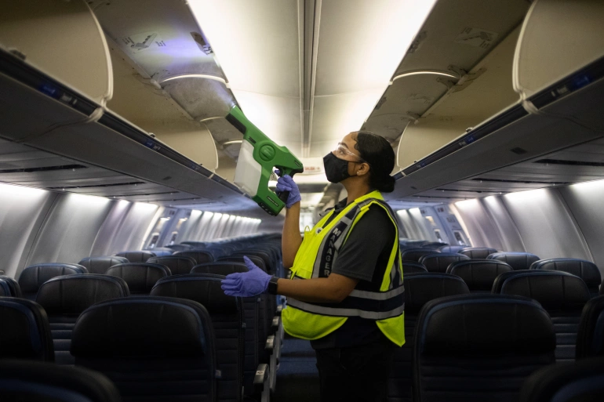

On March 12, 2020, Philippine President Rodrigo Duterte announced the halt of domestic land, sea, and air travel to and from Manila beginning on March 15. The National Capital Region (NCR) and the Greater Manila Area (GMA) were under Extensive Community Quarantine (ECQ) to curb the spread of COVID-19. International flights to key cities in the country had followed as well. While the government has advised everyone to stay at home, it was an entirely different story for air traffic controllers, albeit with the new safety procedures and health protocols mandated by the Department of Health.

The Air Traffic Service of the Civil Aviation Authority of the Philippines (CAAP) officially inaugurated the Philippine Air Traffic Management Center (ATMC) last August 2019 as it gears towards the integration of systems of the approach control and en route facilities of the country. The new integrated system addresses the increasing demand for air travel in the country.

Beginning March 15, all domestic flights and most international flights have halted in an attempt to restrain the spread of COVID-19 in the Philippines. Because of this, it significantly reduced the air traffic volume by more than 90%. Due to the low volume of air traffic across the country, the Air Traffic Service of CAAP has reformulated the new working schedule to ensure that there would be fewer ATCs reporting for duty on a given day. Pre-COVID, air traffic controllers here in the Philippines work 40 hrs a week with two days off. However, during the pandemic, we are only required to work 24-hrs straight, and the remaining days of the week will be either a day off or a work-from-home set up to meet the 40-hr work week requirement from the Commission of Audit (COA). ATCs on duty are required to wear face masks during their tour of duty and to observe social distancing and frequent hand washing to minimize the spread of the virus.

Since there is a surplus of air traffic controllers, CAAP has announced that it will suspend the recruitment of the new batch of air traffic controllers. We are currently in a situation where we encounter a surplus of air traffic controllers to cope with the limited demand, and it still unclear as of this writing how demand for air travel will recover. Aviation experts say that it would take at least 12-18 months before we get back to at least 80% of the peaks we saw in 2019. Therefore, there would be less demand for air traffic controllers in the country in a few years to come.

The Air Traffic Service has crafted new procedures regarding handling situations like this one, the global pandemic. These procedures ensure the safety of our airmen as we mitigate the spread of COVID-19. The air traffic service has nonetheless never ceased to continuously provide air traffic service to flights that carry stranded locals and OFWs and essential goods.

The COVID-19 pandemic is 'The Big One' that we never anticipated. It caught us off guard. Nevertheless, there is a clear sense that this is going to be one of the main topics of discussion in the Philippines for the foreseeable future.
