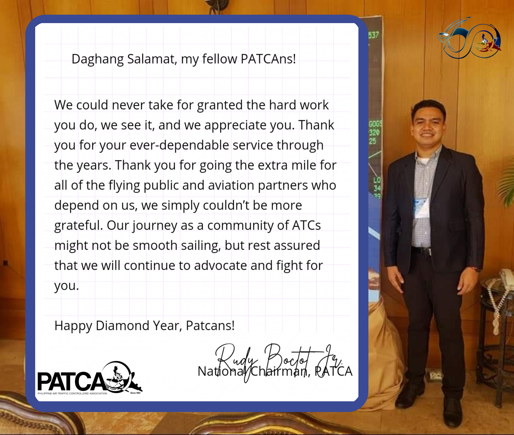

Filipino Air Traffic Controllers formally founded the Philippine Air Traffic Controllers Association (PATCA) in 1962 with the intention of advancing the welfare of its members, the profession, and the aviation industry. Since then, PATCA has been improving the lives of its members, their families, and its aviation partners. PATCA approaches its 60th anniversary, it celebrates with about 1000 active ATCs and the retired ATCs who paved the way in bringing about change that is relevant and long-lasting and in ensuring the flying public is safe at all times.

We are reminded of how far we have come and what an unprecedented time we are in as PATCA marks its 60th anniversary. Among other things, we fought to uphold our profession, enhance our working conditions, enhance economic well-being of ATCs, promote safety, and foster camaraderie. We have been adequately prepared for this time over the past 60 years. As we look to the next 60 years, we know that PATCA will continue to be a community of ATCs and partners—all over the country and internationally—willing to maintain our goal as keepers of the sky while ensuring the safe, orderly, and expeditious flow of air traffic. It is clear that we are all in this together during a pandemic that has touched every aspect of our lives. As easy and straightforward as the job may seem, it is never simple. One must go through several difficult training sessions in order to become an air traffic controller. Without air traffic controllers, air traffic control is unimaginable. In normal circumstances, they are invisible like electricity: unseen and unheard of unless a problem arises.

Through the years, the journey of Filipino Air Traffic Controllers was not smooth sailing. We have experienced things that had caused a huge blow not just to the flying public, but also to our morale. We also fought with nature, natural disasters, and other hardships. We wrestled to find the light, we fought for justice, but most importantly, we didn't give up. Giving up isn't part of our nature. We strived, but we move on. We were selfless. All we ever think was the safety of the flying public–that even if we were not allowed to take leaves during Christmas or New Year's Eve, seeing other people reunited with their families was already enough, a reward something that some people will never understand. Through the years, and together, we have proved how strong our mental fortitude was. That is our commitment, that is our dedication, to be determined, dauntless, and a fighter.
###PATCA@60
